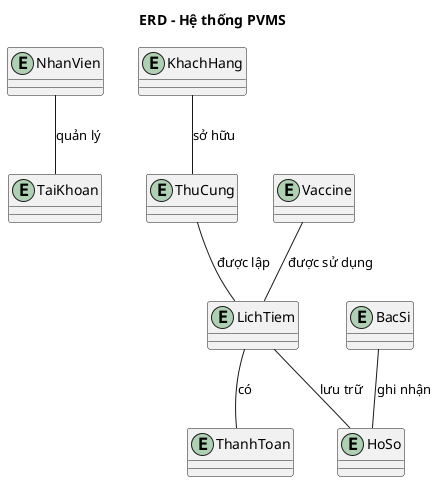
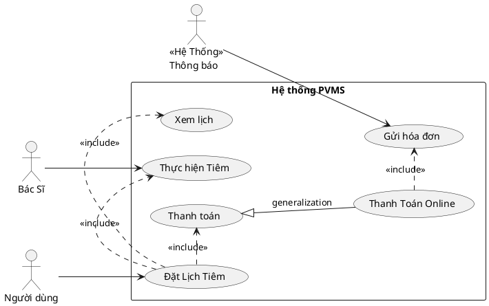

# 🐾 PetVax - Hệ Thống Quản Lý Tiêm Chủng Thú Cưng


## Bắt Đầu Nhanh

### Yêu Cầu Hệ Thống
- Python 3.10+
- Git
- Rect JS

### ⚙️ Cài Đặt
```bash
# 1. Clone dự án
git clone https://github.com/KaiyoDev/PetVax.git
cd PetVax

# 2. Cài đặt môi trường ảo
python -m venv venv
source venv/bin/activate  # Linux/Mac
venv\Scripts\activate     # Windows

# 3. Cài đặt dependencies
pip install -r requirements.txt

# 4. Chạy ứng dụng
flask run
```

---

## 📂 Cấu Trúc Dự Án

```
PetVax/
├── server/
│   ├── app/              # Core application
│   │   ├── __init__.py
│   │   ├── routes/       # API endpoints
│   │   ├── models/       # Database models
│   │   └── utils/        # Helper functions
│   ├── config.py         # Configuration
│   └── requirements.txt
├── client/               # Frontend (sẽ thêm sau)
└── docs/                 # Tài liệu
```

I. Tổng quan dự án:

🐾 1. Bối cảnh

Ngày nay, với số lượng thú cưng (đặc biệt là chó và mèo) ngày càng tăng, việc đảm bảo sức khỏe và tiêm chủng cho chúng là điều vô cùng cần thiết. Tuy nhiên, nhiều chủ nuôi gặp khó khăn trong việc theo dõi lịch tiêm chủng, tình trạng sức khỏe và các dịch vụ chăm sóc liên quan. Điều này dẫn đến nguy cơ thú cưng khôngContext </summary>
```plantuml
@startuml
@context
title Biểu đồ ngữ cảnh hệ thống PVMS

entity "Khách Hàng" as KH
entity "Nhân Viên" as NV
entity "Quản Trị Viên" as QTV
entity "Bác Sĩ" as BS
entity "Cổng thanh toán" as Payment
entity "Thông báo" as Notify

system "Hệ thống PVMS" as PVMS

KH --> PVMS : Gửi yêu cầu / Đặt lịch
KH --> PVMS : Gửi yêu cầu hỗ trợ\nnhận lịch hẹn
PVMS --> KH : Thông báo hệ thống
PVMS --> KH : Thông báo lịch tiêm

NV --> PVMS : Hỗ trợ khách hàng
NV --> PVMS : Quản lý lịch hẹn
NV --> PVMS : Quản lý khách hàng

QTV --> PVMS : Quản lý website
QTV --> PVMS : Tạo báo cáo

PVMS --> Payment : Yêu cầu thanh toán
Payment --> PVMS : Xác nhận giao dịch

PVMS --> BS : Trả kết quả
PVMS --> BS : Nhận lịch tiêm

PVMS --> Notify : Gửi thông báo
@enduml
```
---
<details>
<summary> Code PlantUML USE </summary>

---
<details>
<summary> Code PlantUML USE </summary>


---
<details>


