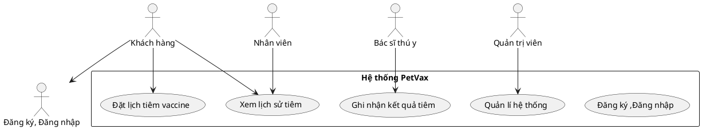
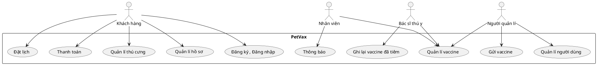
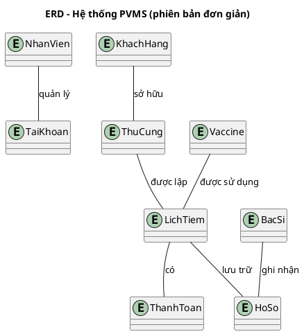
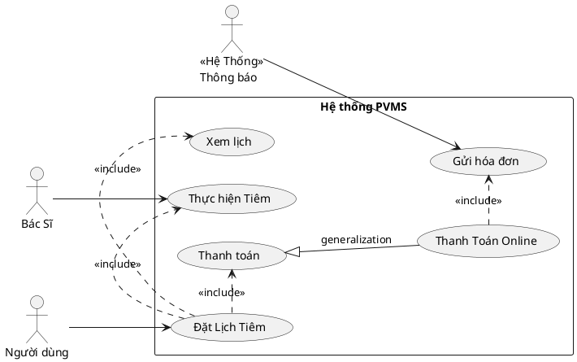

# 🐾 PetVax - Hệ Thống Quản Lý Tiêm Chủng Thú Cưng


## Bắt Đầu Nhanh

### Yêu Cầu Hệ Thống
- Python 3.10+
- Git
- Rect JS

### ⚙️ Cài Đặt
```bash
# 1. Clone dự án
git clone https://github.com/KaiyoDev/PetVax.git
cd PetVax

# 2. Cài đặt môi trường ảo
python -m venv venv
source venv/bin/activate  # Linux/Mac
venv\Scripts\activate     # Windows

# 3. Cài đặt dependencies
pip install -r requirements.txt

# 4. Chạy ứng dụng
flask run
```

---

## 📂 Cấu Trúc Dự Án

```
PetVax/
├── server/
│   ├── app/              # Core application
│   │   ├── __init__.py
│   │   ├── routes/       # API endpoints
│   │   ├── models/       # Database models
│   │   └── utils/        # Helper functions
│   ├── config.py         # Configuration
│   └── requirements.txt
├── client/               # Frontend (sẽ thêm sau)
└── docs/                 # Tài liệu
```

# I. Tổng quan dự án:

**🐾 1. Bối cảnh**

Ngày nay, với số lượng thú cưng (đặc biệt là chó và mèo) ngày càng tăng, việc đảm bảo sức khỏe và tiêm chủng cho chúng là điều vô cùng cần thiết. Tuy nhiên, nhiều chủ nuôi gặp khó khăn trong việc theo dõi lịch tiêm chủng, tình trạng sức khỏe và các dịch vụ chăm sóc liên quan. Điều này dẫn đến nguy cơ thú cưng không được tiêm đầy đủ hoặc không được chăm sóc y tế kịp thời.

Các trung tâm tiêm chủng mong muốn có một phần mềm giúp chủ nuôi dễ dàng kiểm soát việc tiêm chủng cho thú cưng, đồng thời nâng cao hiệu quả quản lý và chất lượng dịch vụ.

**🎯 2. Mục tiêu**

Hệ thống PVMS được xây dựng với các mục tiêu chính:

- Số hóa toàn bộ quy trình tiêm chủng và chăm sóc sức khỏe thú cưng
- Hỗ trợ chủ nuôi theo dõi lịch tiêm, tình trạng sức khỏe và hồ sơ tiêm chủng
- Cung cấp dịch vụ tiêm chủng tại trung tâm và tại nhà một cách thuận tiện
- Tối ưu hóa hoạt động vận hành của trung tâm tiêm chủng
- Tăng cường kết nối giữa chủ nuôi, bác sĩ thú y và nhân viên trung tâm

**3. Phạm vi ứng dụng**

Hệ thống PVMS được thiết kế để phục vụ các đối tượng sau:

- **Chủ nuôi thú cưng**: Quản lý hồ sơ, đặt lịch tiêm, thanh toán, nhận thông báo và hộ chiếu thú cưng
- **Nhân viên trung tâm**: Quản lý khách hàng, xử lý check-in, phân công bác sĩ, quản lý microchip và thanh toán
- **Bác sĩ thú y**: Khám sức khỏe, xác nhận tiêm, theo dõi phản ứng sau tiêm, điều chỉnh lịch và tái khám
- **Quản trị viên hệ thống**: Quản lý tài khoản, vaccine/gói vaccine, lô vaccine, và báo cáo tổng hợp

Phạm vi triển khai:
- Trung tâm tiêm chủng thú cưng tại thành phố và địa phương
- Phòng khám thú y có nhu cầu quản lý tiêm chủng chuyên nghiệp
- Dịch vụ thú y lưu động cung cấp tiêm chủng tại nhà

**4. Giải pháp đề xuất**

Hệ thống quản lý tiêm chủng vaccine cho thú cưng (PVMS) được phát triển nhằm cung cấp một giải pháp toàn diện, cho phép chủ nuôi dễ dàng:
- Định danh thú cưng bằng microchip hoặc hình ảnh
- Quản lý hồ sơ tiêm chủng và sức khỏe thú cưng
- Đặt lịch tiêm tại trung tâm hoặc tại nhà
- Tư vấn và chăm sóc sức khỏe trước tiêm
- Tra cứu thông tin vaccine, bảng giá và gói dịch vụ
- Thanh toán trực tuyến qua VnPay, PayOS…
- Nhận thông báo lịch tiêm và cấp hộ chiếu thú cưng
- Theo dõi quá trình tiêm chủng và lịch sử dịch vụ
Hệ thống không chỉ nâng cao sức khỏe thú cưng mà còn giúp chủ nuôi quản lý thông tin một cách chính xác và hiệu quả.

# II. Chức năng chính của hệ thống
**1.Các tác nhân:**

-Khách hàng: đăng kí/đăng nhập vào đặt lịch tiêm cho thú cưng.

-Nhân viên: quản lí lịch tiêm, xem thông báo, tư vấn khách hàng.

-Bác sĩ thú y: xem tình trạng và tiêm loại vaccine phù hợp cho thú cưng.

-Quản trị viên: quản lí tài khoản, quản lí vaccine và hệ thống.


<details>
<summary>Code PlantUML</summary>


</details> 

**1. Người dùng (Chủ nuôi thú cưng)**

Người dùng là đối tượng chính sử dụng hệ thống để quản lý việc tiêm chủng và chăm sóc sức khỏe cho thú cưng. Các chức năng chính bao gồm:

-Đăng ký và đăng nhập hệ thống

-Quản lý hồ sơ thú cưng: tên, tuổi, giống loài, màu sắc, hình ảnh, ngày sinh…

-Quản lý lịch sử tiêm chủng: loại vaccine, thời gian tiêm, kết quả tiêm

-Đặt lịch tiêm chủng tại trung tâm hoặc tại nhà

-Tra cứu thông tin vaccine, gói vaccine và bảng giá

-Nhận tư vấn sức khỏe trước tiêm: khám tổng quát, lựa chọn vaccine phù hợp

-Nhận thông báo lịch tiêm sắp tới và các lưu ý sau tiêm

-Thanh toán dịch vụ qua các kênh điện tử (VnPay, PayOS…)

-Yêu cầu cấp hộ chiếu thú cưng

-Xem lịch sử dịch vụ đã sử dụng và quản lý hồ sơ cá nhân

**2. Bác sĩ thú y (Vet)**

Bác sĩ thú y là người trực tiếp thực hiện khám và tiêm chủng cho thú cưng. Hệ thống hỗ trợ bác sĩ với các chức năng sau:

-Khám sức khỏe thú cưng trước khi tiêm

-Điều chỉnh lịch tiêm nếu thú cưng không đủ điều kiện sức khỏe

-Xác nhận quá trình tiêm chủng và ghi nhận phản ứng sau tiêm

-Xem danh sách ca khám trong ngày

-Truy cập hồ sơ và lịch sử tiêm chủng của thú cưng

-Đặt lịch tái khám khi phát hiện vấn đề sức khỏe

**3.Nhân viên (Staff)**
Nhân viên là người tương tác và tiếp xúc với khách hàng, hỗ trợ đặt lịch cũng như tư vấn dịch vụ với các chức năng sau:

-Hỗ trợ chuẩn bị vaccine, theo dõi sẵn sàng vật tư

-Xác nhận khách (check-in)

-Thực hiện tiêm dưới giám sát vet (nếu quy trình yêu cầu)

-Ghi chép cơ bản về quy trình tiêm (thời gian, người thực hiện)

-Quản lý tồn kho vaccine cơ bản (thêm/giảm, kiểm kê sơ bộ)

-Hỗ trợ cấp hộ chiếu, in ấn giấy tờ

**4.Quản trị viên (Admin)**
Quản trị viên là người điều hành hệ thống cũng như quản lí cơ sở dữ liệu với các chức năng sau:

-Quản lý người dùng (CRUD user, phân vai trò)

-Quản lý bác sĩ, nhân viên, cơ sở/chi nhánh

-Quản lý danh mục vaccine: tên, nhà sản xuất, lô, hạn dùng, liều, lịch tiêm chuẩn

-Quản lý gói vaccine & bảng giá (dịch vụ) — tạo, sửa, kích hoạt/hủy

-Quản lý lịch làm việc bác sĩ/chi nhánh

-Xem báo cáo: số lượng tiêm theo ngày/tuần/tháng, doanh thu, tồn kho, phản ứng sau tiêm

-Xử lý khiếu nại / hoàn tiền / refund policy

-Cấu hình kênh thông báo (email/SMS/push) và cổng thanh toán

-Quản trị bảo mật: audit log, quyền truy cập, khóa tài khoản

# Sơ đồ Use-case:


<details>
<summary>Code PlantUML</summary>


</details> 

# Sơ đồ Use-case chi tiết:
**1.Người dùng**


<details>
<summary>Code PlantUML</summary>

```plantuml
@startuml

actor "Khách hàng" as KH

PetVax {
  usecase "Đăng ký,đăng nhập" as UC1
  usecase "Quản lí thông tin" as UC2
  usecase "Nhận thông báo" as UC3
  usecase "Đặt lịch tiêm" as UC4
}

KH --> UC1
KH --> UC2
KH --> UC3
KH --> UC4
@enduml
```
</details> 

**2.Bác sĩ thú y**


<details>
<summary>Code PlantUML</summary>

```plantuml
@startuml
left to right direction

actor "Bác sĩ thú y" as BS

PetVax {
  usecase "Kiểm tra tình trạng thú cưng" as UC1
  usecase "Tiêm thú cưng" as UC2
}

BS --> UC1
BS --> UC2
@enduml
```
</details> 

**3.Nhân viên**


<details>
<summary>Code PlantUML</summary>

```plantuml
@startuml
actor "Nhân viên" as NV

PetVax {
  usecase "Hỗ trợ Tư vấn khách hàng" as UC1
  usecase "Xem thông tin (khách hàng, lịch tiêm, ca trực)" as UC2
}

NV --> UC1
NV --> UC2
@enduml
```
</details> 

**4.Quản trị viên**


<details>
<summary>Code PlantUML</summary>

```plantuml
@startuml
actor "Quản trị viên" as QT

PetVax {
  usecase "Quản lí tài khoản" as UC1
  usecase "Quản lí dữ liệu (khách hàng, bác sĩ, nhân viên)" as UC2
}

QT --> UC1
QT --> UC2
@enduml
```
</details> 

# III. Yêu cầu phi chức năng

Yêu cầu phi chức năng mô tả các đặc điểm kỹ thuật và vận hành mà hệ thống PVMS cần đáp ứng để đảm bảo hiệu suất, bảo mật và khả năng sử dụng lâu dài.

**1. Hiệu năng hệ thống**
- Hệ thống phải xử lý đồng thời nhiều yêu cầu từ người dùng mà không bị gián đoạn.
- Thời gian phản hồi cho các thao tác cơ bản (đăng nhập, tra cứu, đặt lịch) không vượt quá 3 giây.
- Hệ thống phải có khả năng mở rộng để phục vụ hàng nghìn người dùng và thú cưng.

 **2. Bảo mật**
- Dữ liệu người dùng và thú cưng phải được mã hóa trong quá trình truyền tải và lưu trữ.
- Hệ thống phải có cơ chế phân quyền rõ ràng giữa các vai trò: khách hàng, nhân viên, bác sĩ, quản trị viên.
- Phải có chức năng ghi nhận và theo dõi hoạt động người dùng khi thực hiện các chức năng quan trọng (audit log).
- Hệ thống phải hỗ trợ xác thực hai yếu tố (2FA) cho tài khoản quản trị viên.

 **3. Tính khả dụng và ổn định**
- Hệ thống phải hoạt động liên tục 24/7, với thời gian gián đoạn không vượt quá 0.1% mỗi tháng.
- Phải có cơ chế sao lưu dữ liệu định kỳ và khôi phục khi xảy ra sự cố.

**4. Tính tương thích**
- Hệ thống phải hỗ trợ đầy đủ font Unicode để hiển thị tiếng Việt chính xác.
- Giao diện phải tương thích với các trình duyệt phổ biến (Chrome, Edge, Firefox, Safari).
- Hệ thống phải hoạt động tốt trên cả thiết bị máy tính và di động (responsive design).

**🧩 5. Khả năng mở rộng**
- Kiến trúc hệ thống phải cho phép tích hợp thêm các dịch vụ thú y khác như xét nghiệm, điều trị, lưu trú…
- Có thể kết nối với hệ thống quản lý microchip quốc gia hoặc quốc tế trong tương lai.

 **🧠 6. Tính dễ sử dụng**
- Giao diện người dùng phải thân thiện, dễ thao tác với người không am hiểu công nghệ.
- Các chức năng chính phải được bố trí hợp lý, dễ truy cập và có hướng dẫn sử dụng rõ ràng.

# IV. Sơ Đồ Và PlantULM  
```bash 
@startuml
title Trình tự: Khách đặt lịch tiêm tại trung tâm

actor Customer
participant "Web Client (React)" as Web
participant "Auth API (/api/auth)" as Auth
participant "Customer API (/api/customer)" as Cust
database "DB (SQLAlchemy)" as DB
participant "Payment Gateway (VnPay - Sim)" as Pay
participant "Notification Service" as Noti

== Đăng nhập ==
Customer -> Web: Nhập username/password
Web -> Auth: POST /login {username, password}
Auth -> DB: Kiểm tra user, mật khẩu
DB --> Auth: OK, trả user
Auth --> Web: 200 {JWT token}
Web -> Web: Lưu token (localStorage), set Authorization

== Tạo lịch hẹn ==
Customer -> Web: Chọn pet, ngày giờ, type=center
Web -> Cust: POST /appointments {pet_id, appointment_date, type}
Cust -> DB: Tạo Appointment(status=PENDING)
DB --> Cust: Appointment ID
Cust --> Web: 201 {appointment}

== Thanh toán ==
Customer -> Web: Chọn thanh toán
Web -> Cust: POST /payments {appointment_id, method=vnpay}
Cust -> DB: Tạo Payment(PENDING)
Cust -> Pay: Giao dịch (mô phỏng)
Pay --> Cust: PAID + transaction_id
Cust -> DB: Cập nhật Payment=PAID
Cust --> Web: 201 {payment=PAID}

== Thông báo ==
Cust -> Noti: Gửi thông báo xác nhận
Noti -> DB: Lưu Notification
Noti --> Cust: OK

Web --> Customer: Hiển thị "Lịch hẹn đã được tạo & thanh toán thành công"
@enduml
```
---
<details> 
<summary> Code PlantUML</summary>
```plantuml 
@startuml
@context
title Biểu đồ ngữ cảnh hệ thống PVMS

entity "Khách Hàng" as KH
entity "Nhân Viên" as NV
entity "Quản Trị Viên" as QTV
entity "Bác Sĩ" as BS
entity "Cổng thanh toán" as Payment
entity "Thông báo" as Notify

system "Hệ thống PVMS" as PVMS

KH --> PVMS : Gửi yêu cầu / Đặt lịch
KH --> PVMS : Gửi yêu cầu hỗ trợ\nnhận lịch hẹn
PVMS --> KH : Thông báo hệ thống
PVMS --> KH : Thông báo lịch tiêm

NV --> PVMS : Hỗ trợ khách hàng
NV --> PVMS : Quản lý lịch hẹn
NV --> PVMS : Quản lý khách hàng

QTV --> PVMS : Quản lý website
QTV --> PVMS : Tạo báo cáo

PVMS --> Payment : Yêu cầu thanh toán
Payment --> PVMS : Xác nhận giao dịch

PVMS --> BS : Trả kết quả
PVMS --> BS : Nhận lịch tiêm

PVMS --> Notify : Gửi thông báo
@enduml
```
<details>


<details>
<summary> Code PlantUML</summary>


</details>


<details>
<summary> Code PlantUML</summary>


</details>

