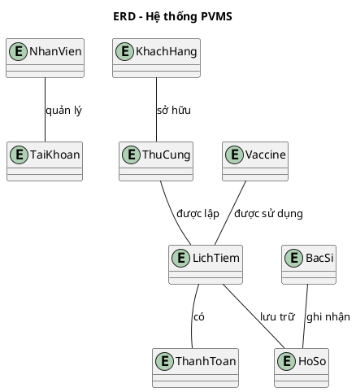
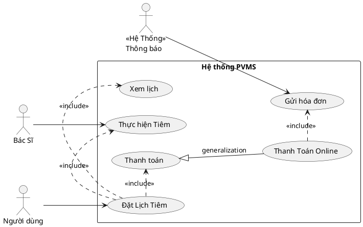

# 🐾 PetVax - Hệ Thống Quản Lý Tiêm Chủng Thú Cưng


## Bắt Đầu Nhanh

### Yêu Cầu Hệ Thống
- Python 3.10+
- Git
- Rect JS

### ⚙️ Cài Đặt
```bash
# 1. Clone dự án
git clone https://github.com/KaiyoDev/PetVax.git
cd PetVax

# 2. Cài đặt môi trường ảo
python -m venv venv
source venv/bin/activate  # Linux/Mac
venv\Scripts\activate     # Windows

# 3. Cài đặt dependencies
pip install -r requirements.txt

# 4. Chạy ứng dụng
flask run
```

---

## 📂 Cấu Trúc Dự Án

```
PetVax/
├── server/
│   ├── app/              # Core application
│   │   ├── __init__.py
│   │   ├── routes/       # API endpoints
│   │   ├── models/       # Database models
│   │   └── utils/        # Helper functions
│   ├── config.py         # Configuration
│   └── requirements.txt
├── client/               # Frontend (sẽ thêm sau)
└── docs/                 # Tài liệu
```

I. Tổng quan dự án:

🐾 1. Bối cảnh

Ngày nay, với số lượng thú cưng (đặc biệt là chó và mèo) ngày càng tăng, việc đảm bảo sức khỏe và tiêm chủng cho chúng là điều vô cùng cần thiết. Tuy nhiên, nhiều chủ nuôi gặp khó khăn trong việc theo dõi lịch tiêm chủng, tình trạng sức khỏe và các dịch vụ chăm sóc liên quan. Điều này dẫn đến nguy cơ thú cưng không được tiêm đầy đủ hoặc không được chăm sóc y tế kịp thời.

Các trung tâm tiêm chủng mong muốn có một phần mềm giúp chủ nuôi dễ dàng kiểm soát việc tiêm chủng cho thú cưng, đồng thời nâng cao hiệu quả quản lý và chất lượng dịch vụ.

🎯 2. Mục tiêu

Hệ thống PVMS được xây dựng với các mục tiêu chính:

- Số hóa toàn bộ quy trình tiêm chủng và chăm sóc sức khỏe thú cưng
- Hỗ trợ chủ nuôi theo dõi lịch tiêm, tình trạng sức khỏe và hồ sơ tiêm chủng
- Cung cấp dịch vụ tiêm chủng tại trung tâm và tại nhà một cách thuận tiện
- Tối ưu hóa hoạt động vận hành của trung tâm tiêm chủng
- Tăng cường kết nối giữa chủ nuôi, bác sĩ thú y và nhân viên trung tâm

📌 3. Phạm vi ứng dụng

Hệ thống PVMS được thiết kế để phục vụ các đối tượng sau:

- **Chủ nuôi thú cưng**: Quản lý hồ sơ, đặt lịch tiêm, thanh toán, nhận thông báo và hộ chiếu thú cưng
- **Nhân viên trung tâm**: Quản lý khách hàng, xử lý check-in, phân công bác sĩ, quản lý microchip và thanh toán
- **Bác sĩ thú y**: Khám sức khỏe, xác nhận tiêm, theo dõi phản ứng sau tiêm, điều chỉnh lịch và tái khám
- **Quản trị viên hệ thống**: Quản lý tài khoản, vaccine/gói vaccine, lô vaccine, và báo cáo tổng hợp

Phạm vi triển khai:
- Trung tâm tiêm chủng thú cưng tại thành phố và địa phương
- Phòng khám thú y có nhu cầu quản lý tiêm chủng chuyên nghiệp
- Dịch vụ thú y lưu động cung cấp tiêm chủng tại nhà

💡 4. Giải pháp đề xuất

Hệ thống quản lý tiêm chủng vaccine cho thú cưng (PVMS) được phát triển nhằm cung cấp một giải pháp toàn diện, cho phép chủ nuôi dễ dàng:
- Định danh thú cưng bằng microchip hoặc hình ảnh
- Quản lý hồ sơ tiêm chủng và sức khỏe thú cưng
- Đặt lịch tiêm tại trung tâm hoặc tại nhà
- Tư vấn và chăm sóc sức khỏe trước tiêm
- Tra cứu thông tin vaccine, bảng giá và gói dịch vụ
- Thanh toán trực tuyến qua VnPay, PayOS…
- Nhận thông báo lịch tiêm và cấp hộ chiếu thú cưng
- Theo dõi quá trình tiêm chủng và lịch sử dịch vụ
Hệ thống không chỉ nâng cao sức khỏe thú cưng mà còn giúp chủ nuôi quản lý thông tin một cách chính xác và hiệu quả.

II. Chức năng chính của hệ thống

1. Người dùng (Chủ nuôi thú cưng)

Người dùng là đối tượng chính sử dụng hệ thống để quản lý việc tiêm chủng và chăm sóc sức khỏe cho thú cưng. Các chức năng chính bao gồm:

- 🔐 Đăng ký và đăng nhập hệ thống
- 🐶 Quản lý hồ sơ thú cưng: tên, tuổi, giống loài, màu sắc, hình ảnh, ngày sinh…
- 💉 Quản lý lịch sử tiêm chủng: loại vaccine, thời gian tiêm, kết quả tiêm
- 📅 Đặt lịch tiêm chủng tại trung tâm hoặc tại nhà
- 🧾 Tra cứu thông tin vaccine, gói vaccine và bảng giá
- 🩺 Nhận tư vấn sức khỏe trước tiêm: khám tổng quát, lựa chọn vaccine phù hợp
- 📲 Nhận thông báo lịch tiêm sắp tới và các lưu ý sau tiêm
- 💳 Thanh toán dịch vụ qua các kênh điện tử (VnPay, PayOS…)
- 🛂 Yêu cầu cấp hộ chiếu thú cưng
- 📖 Xem lịch sử dịch vụ đã sử dụng và quản lý hồ sơ cá nhân

2. Bác sĩ thú y (Vet)

Bác sĩ thú y là người trực tiếp thực hiện khám và tiêm chủng cho thú cưng. Hệ thống hỗ trợ bác sĩ với các chức năng sau:

- 🩺 Khám sức khỏe thú cưng trước khi tiêm
- ⏳ Điều chỉnh lịch tiêm nếu thú cưng không đủ điều kiện sức khỏe
- ✅ Xác nhận quá trình tiêm chủng và ghi nhận phản ứng sau tiêm
- 📋 Xem danh sách ca khám trong ngày
- 📂 Truy cập hồ sơ và lịch sử tiêm chủng của thú cưng
- 🔄 Đặt lịch tái khám khi phát hiện vấn đề sức khỏe

3. Thú cưng (Đối tượng quản lý)

Thú cưng là trung tâm của hệ thống, được định danh và quản lý thông qua hồ sơ chi tiết. Các chức năng liên quan đến thú cưng bao gồm:

- 🆔 Định danh bằng microchip hoặc hình ảnh
- 📄 Lưu trữ hồ sơ cá nhân: tên, tuổi, giống, màu sắc, hình ảnh…
- 💉 Lưu trữ lịch sử tiêm chủng: loại vaccine, thời gian, kết quả
- 🩺 Ghi nhận tình trạng sức khỏe trước và sau tiêm
- 🛂 Cấp hộ chiếu thú cưng khi đủ điều kiện tiêm chủng

<details>
<summary> Code PlantUML Context </summary>
```plantuml
@startuml
@context
title Biểu đồ ngữ cảnh hệ thống PVMS

entity "Khách Hàng" as KH
entity "Nhân Viên" as NV
entity "Quản Trị Viên" as QTV
entity "Bác Sĩ" as BS
entity "Cổng thanh toán" as Payment
entity "Thông báo" as Notify

system "Hệ thống PVMS" as PVMS

KH --> PVMS : Gửi yêu cầu / Đặt lịch
KH --> PVMS : Gửi yêu cầu hỗ trợ\nnhận lịch hẹn
PVMS --> KH : Thông báo hệ thống
PVMS --> KH : Thông báo lịch tiêm

NV --> PVMS : Hỗ trợ khách hàng
NV --> PVMS : Quản lý lịch hẹn
NV --> PVMS : Quản lý khách hàng

QTV --> PVMS : Quản lý website
QTV --> PVMS : Tạo báo cáo

PVMS --> Payment : Yêu cầu thanh toán
Payment --> PVMS : Xác nhận giao dịch

PVMS --> BS : Trả kết quả
PVMS --> BS : Nhận lịch tiêm

PVMS --> Notify : Gửi thông báo
@enduml
```
---
<details>
<details>
<summary> Code PlantUML ERD </summary>

---
<details>
<details>
<summary> Code PlantUML USE </summary>


---
<details>


